# Muhammad Ali's App Portfolio

## Introduction

Welcome to my portfolio of innovative mobile applications, where I combine my expertise in Flutter development with advanced AI and machine learning techniques. Here's a look at some of my standout projects.

---

### Revisable App
**[Revisable](https://www.revisable.in/)**

**Introduction:** 
Revisable is the world's smartest study app, designed specifically for medical and finance students. It leverages AI tools to offer a comprehensive learning experience, from creating study materials to solving question papers.

**Features:**
- AI-Powered Study Tools: Generate study material, solve papers, and create tests and MCQs.
- Smart Flashcards: Customizable flashcards for efficient learning.
- Test Series and Revision Videos: Comprehensive resources for exam preparation.
- ChatGPT Integration: Enhanced learning with advanced AI capabilities.
- Targeted Courses: Specially designed for MBBS, NEET, USMLE, PLAB, CA, CFA, and more.
- Monthly Course Updates: Continual expansion and updating of course material.

**Screenshots:**

  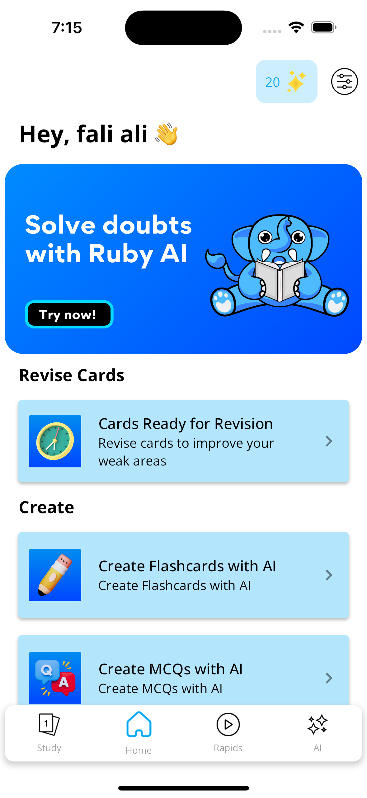
  
  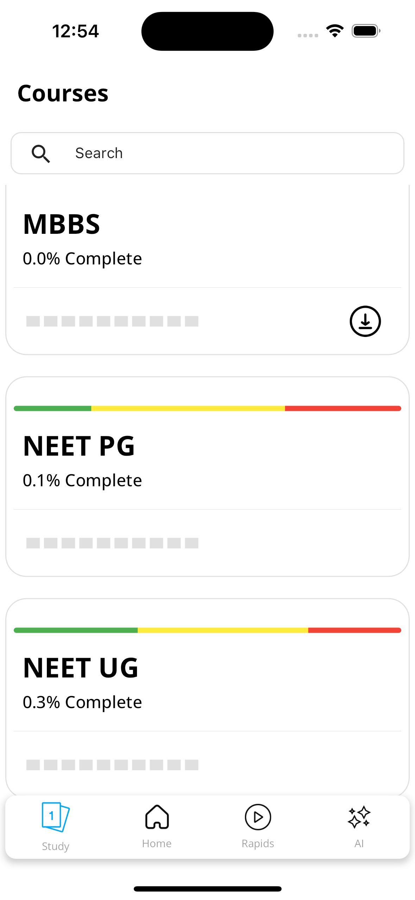

  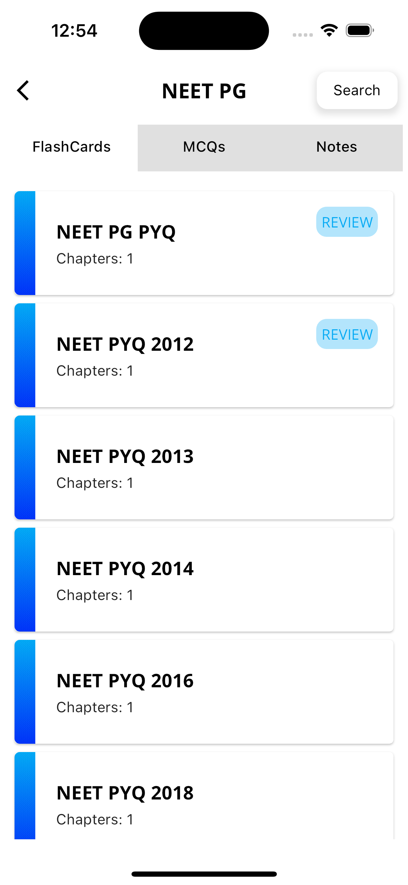
  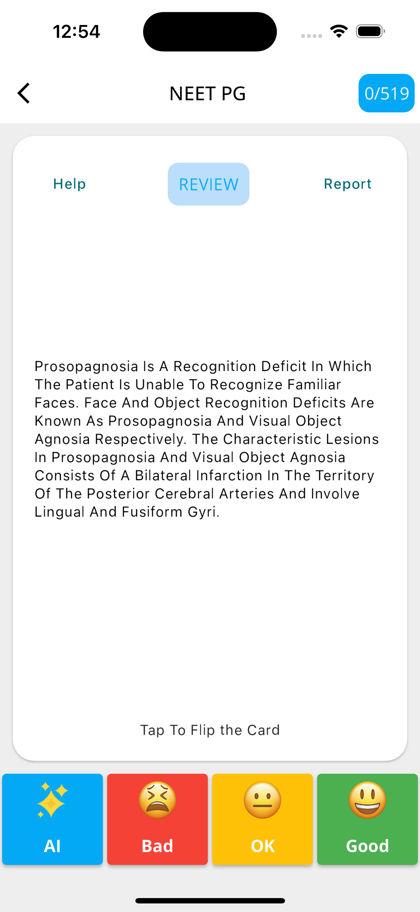
  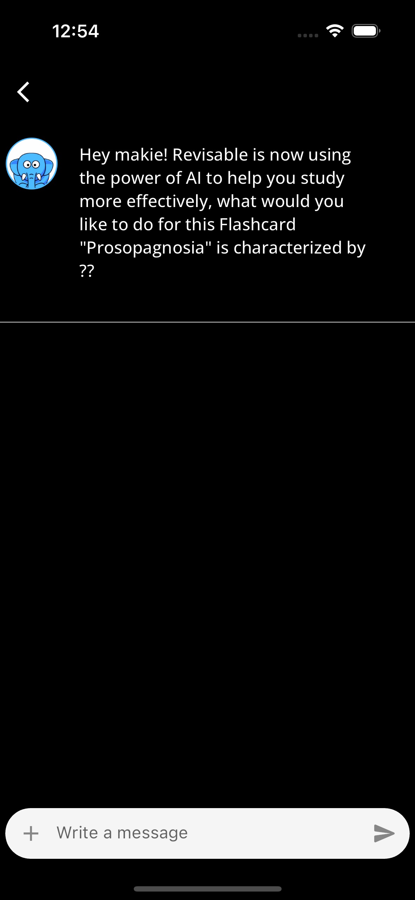

  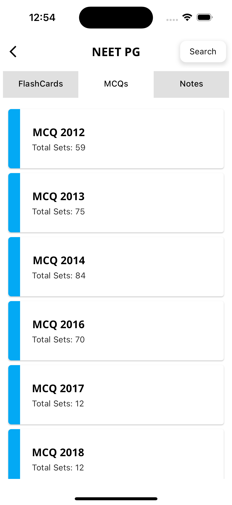
  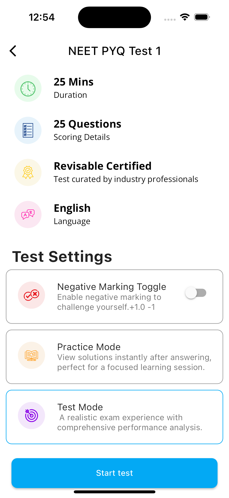
  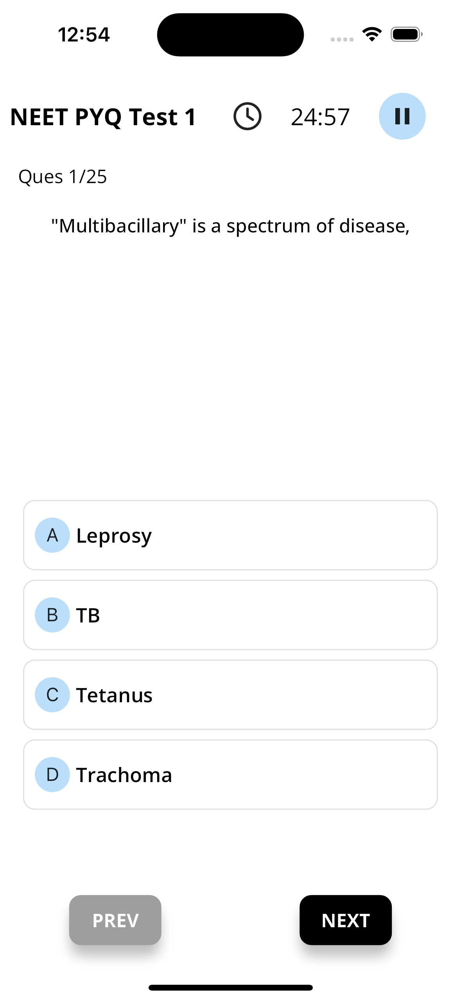

  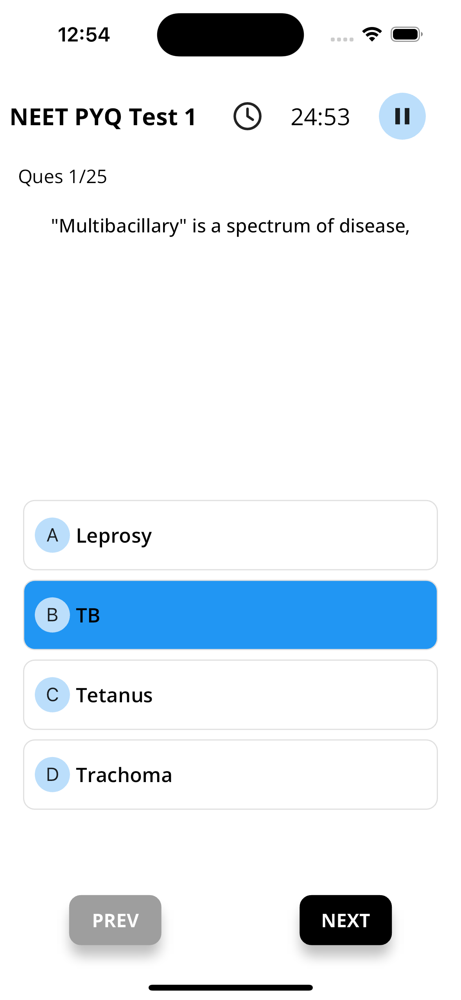
  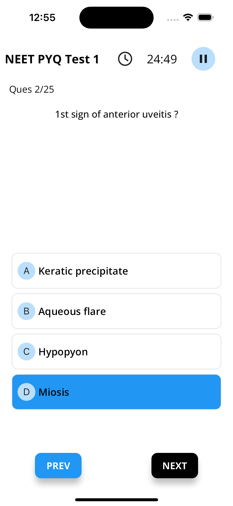
  

  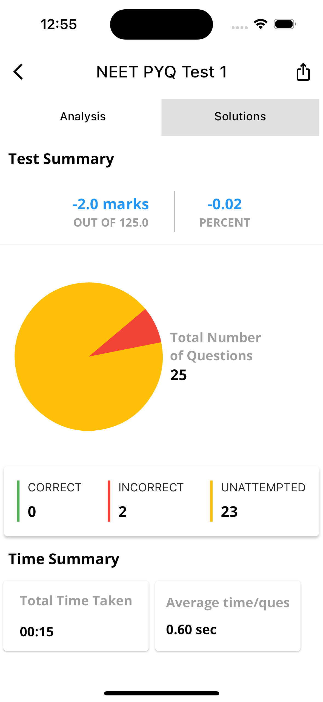
  
  

  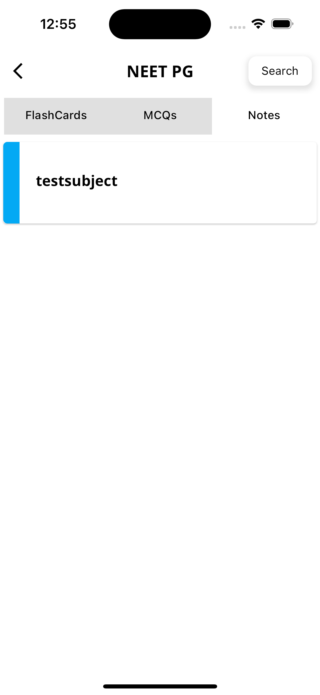
  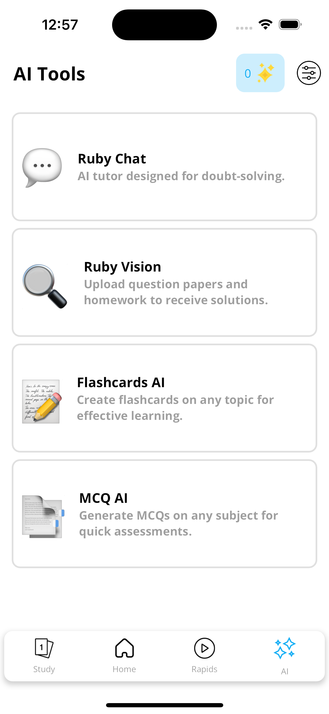
  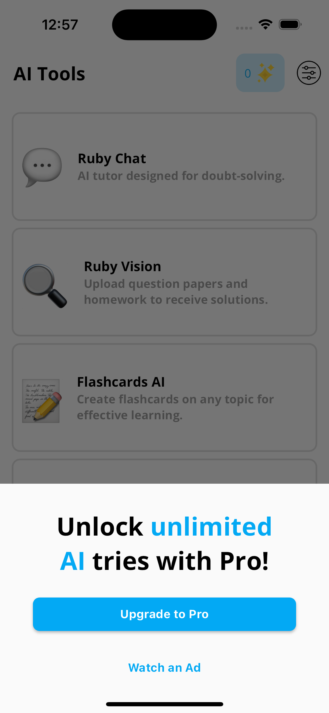

  

---

### Doubt Clear AI
**[Doubt Clear AI](https://www.doubtclear.ai/)**

**Introduction:** 
Doubt Clear AI acts as your personal AI tutor, available 24/7 to assist with homework and exam preparation across various subjects.

**Features:**
- Wide Subject Coverage: Support for Maths, Physics, Chemistry, History, Geography, Languages, and more.
- Scan & Learn: Instant solutions through AI-driven scanning of questions and textbooks.
- Multilingual: Breaks language barriers for a user-friendly experience.
- Expert AI Knowledge: Accurate and insightful subject explanations.
- Grades Improvement: Comprehensive support for excelling in exams and assignments.

**Screenshots:**

  
  
  

  
  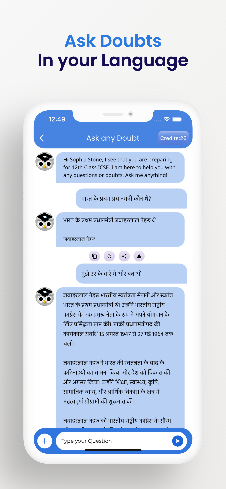
  

  
  

---

## 3) ScriptBae

**Introduction:** 
- [Brief description of ScriptBae]

**Features:**
- Feature 1
- Feature 2
- Feature 3
- ...

**Screenshots:**

...

---

## 4) RemoteTal

**Introduction:** 
- [Brief description of RemoteTal]

**Features:**
- Feature 1
- Feature 2
- Feature 3
- ...

**Screenshots:**

---

## 5) Code AI

**Introduction:** 
- [Brief description of Code AI]

**Features:**
- Feature 1
- Feature 2
- Feature 3
- ...

**Screenshots:**

---

## 6) PizzaGPT

**Introduction:** 
- [Brief description of PizzaGPT]

**Features:**
- Feature 1
- Feature 2
- Feature 3
- ...

**Screenshots:**

---

## 7) SpeechAI

**Introduction:** 
- [Brief description of SpeechAI]

**Features:**
- Feature 1
- Feature 2
- Feature 3
- ...

**Screenshots:**

---
