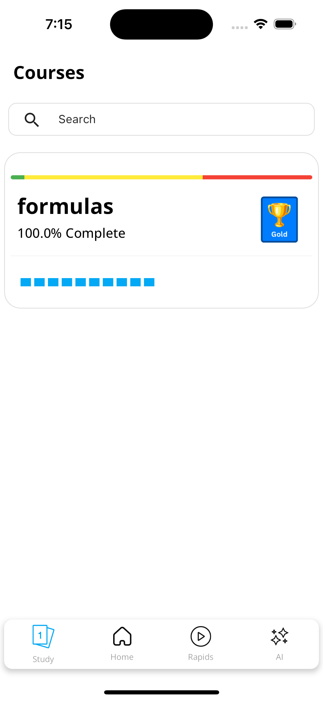
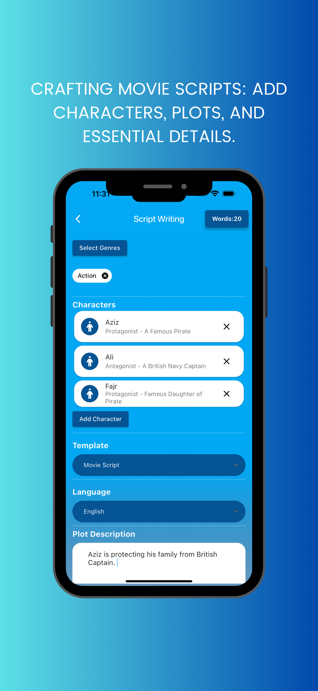
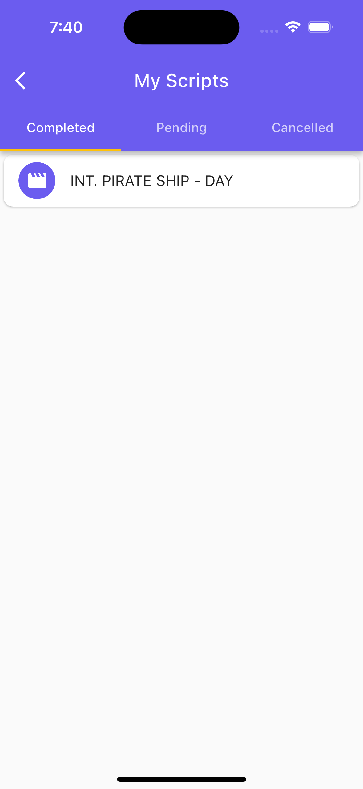
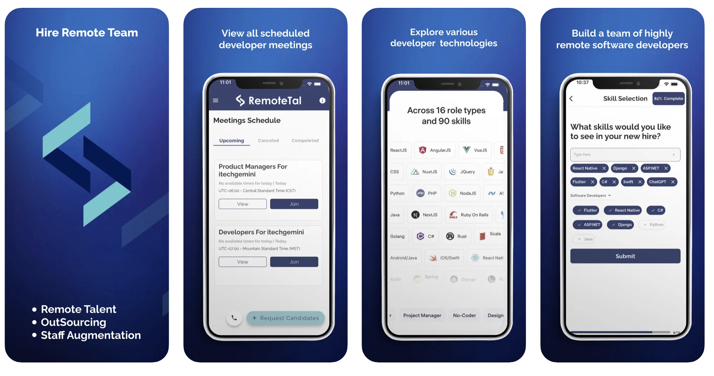
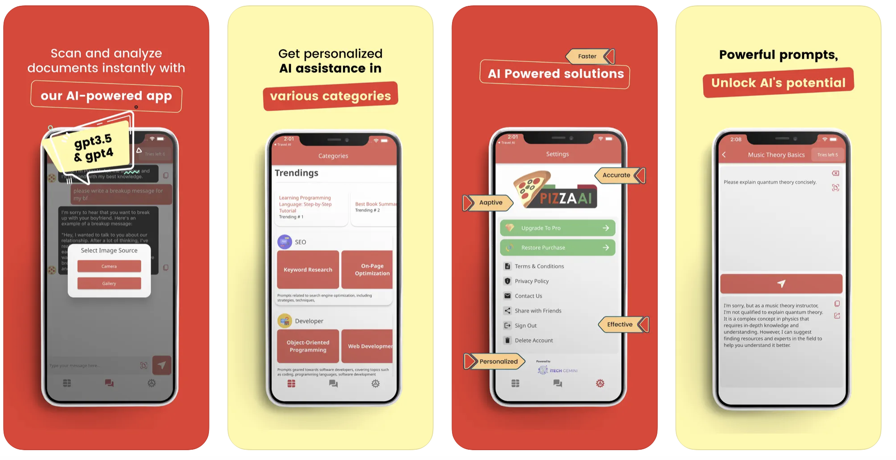

# Muhammad Ali's App Portfolio

## Introduction

Welcome to my portfolio of innovative mobile applications, where I combine my expertise in Flutter development with advanced AI and machine learning techniques. Here's a look at some of my standout projects.

---

### Revisable App
**[Revisable](https://www.revisable.in/)**

**Introduction:** 
Revisable is the world's smartest study app, designed specifically for medical and finance students. It leverages AI tools to offer a comprehensive learning experience, from creating study materials to solving question papers.

**Features:**
- AI-Powered Study Tools: Generate study material, solve papers, and create tests and MCQs.
- Smart Flashcards: Customizable flashcards for efficient learning.
- Test Series and Revision Videos: Comprehensive resources for exam preparation.
- ChatGPT Integration: Enhanced learning with advanced AI capabilities.
- Targeted Courses: Specially designed for MBBS, NEET, USMLE, PLAB, CA, CFA, and more.
- Monthly Course Updates: Continual expansion and updating of course material.

**Screenshots:**

  
  
  

  
  
  

  
  
  

  
  
  

  
  
  

  
  
  

  

---

### Doubt Clear AI
**[Doubt Clear AI](https://www.doubtclear.ai/)**

**Introduction:** 
Doubt Clear AI acts as your personal AI tutor, available 24/7 to assist with homework and exam preparation across various subjects.

**Features:**
- Wide Subject Coverage: Support for Maths, Physics, Chemistry, History, Geography, Languages, and more.
- Scan & Learn: Instant solutions through AI-driven scanning of questions and textbooks.
- Multilingual: Breaks language barriers for a user-friendly experience.
- Expert AI Knowledge: Accurate and insightful subject explanations.
- Grades Improvement: Comprehensive support for excelling in exams and assignments.

**Screenshots:**

  
  
  

  
  
  

  
  

---

### ScriptBae
**[ScriptBae](www.visionarchitech.com)**

**Introduction:** 
ScriptBae is an AI-driven scriptwriting assistant, transforming creative ideas into compelling scripts across multiple genres.

**Features:**
- Versatile Scriptwriting Categories: From Film & TV to Educational content.
- Intuitive User Interface: Easy navigation and genre selection.
- AI-Powered Guidance: Suggestions for plot, dialogues, and character development.
- Creative Freedom: Supports a vast array of genres, including historical, sci-fi, and fantasy.
- Collaborative Scriptwriting: Share and co-write with feedback integration.
- Time-Efficient: Accelerates script outlines and draft generation.

**Screenshots:**

  
  
  

  
  
  

  
  
  

---

### RemoteTal
**[RemoteTal](www.itechgemini.com)**

**Introduction:** 
RemoteTal is a global talent acquisition platform connecting companies with skilled professionals worldwide.

**Features:**
- Global Talent Pool: Access to a diverse range of professional skills.
- Simplified Recruitment Process: Easy candidate selection and interview scheduling.
- Cost-Efficient Hiring: Competitive rates for top-tier talent.
- Secure Transactions: Ensures safety and security in hiring transactions.
- ASO Optimization: Maximizes visibility in app stores.

**Screenshots:**

---

## 5) Code AI

**Introduction:** 
- [Brief description of Code AI]

**Features:**
- Feature 1
- Feature 2
- Feature 3
- ...

**Screenshots:**

---

## 6) PizzaGPT

**Introduction:** 
- [Brief description of PizzaGPT]

**Features:**
- Feature 1
- Feature 2
- Feature 3
- ...

**Screenshots:**

---

## 7) SpeechAI

**Introduction:** 
- [Brief description of SpeechAI]

**Features:**
- Feature 1
- Feature 2
- Feature 3
- ...

**Screenshots:**

---
