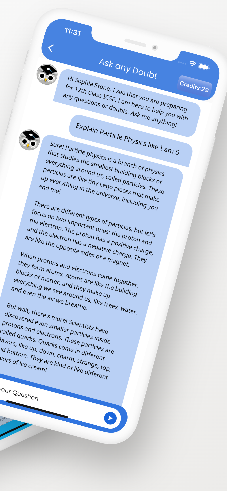
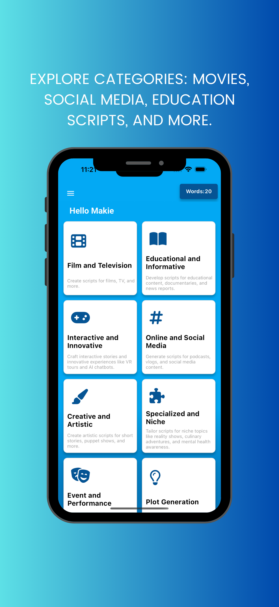

# Muhammad Ali's App Portfolio

## Introduction

Welcome to my portfolio of innovative mobile applications, where I combine my expertise in Flutter development with advanced AI and machine learning techniques. Here's a look at some of my standout projects.

---

## 1) Revisable App

**Introduction:** 
- [Brief description of Revisable App]

**Features:**
- Feature 1
- Feature 2
- Feature 3
- ...

**Screenshots:**

... 

---

## 2) Doubt Clear AI

**Introduction:** 
- [Brief description of Doubt Clear AI]

**Features:**
- Feature 1
- Feature 2
- Feature 3
- ...

**Screenshots:**

...

---

## 3) ScriptBae

**Introduction:** 
- [Brief description of ScriptBae]

**Features:**
- Feature 1
- Feature 2
- Feature 3
- ...

**Screenshots:**

...

---

## 4) RemoteTal

**Introduction:** 
- [Brief description of RemoteTal]

**Features:**
- Feature 1
- Feature 2
- Feature 3
- ...

**Screenshots:**

---

## 5) Code AI

**Introduction:** 
- [Brief description of Code AI]

**Features:**
- Feature 1
- Feature 2
- Feature 3
- ...

**Screenshots:**

---

## 6) PizzaGPT

**Introduction:** 
- [Brief description of PizzaGPT]

**Features:**
- Feature 1
- Feature 2
- Feature 3
- ...

**Screenshots:**

---

## 7) SpeechAI

**Introduction:** 
- [Brief description of SpeechAI]

**Features:**
- Feature 1
- Feature 2
- Feature 3
- ...

**Screenshots:**

---
